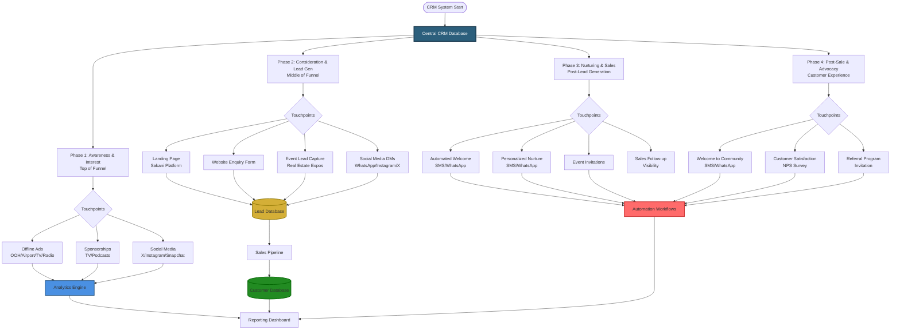
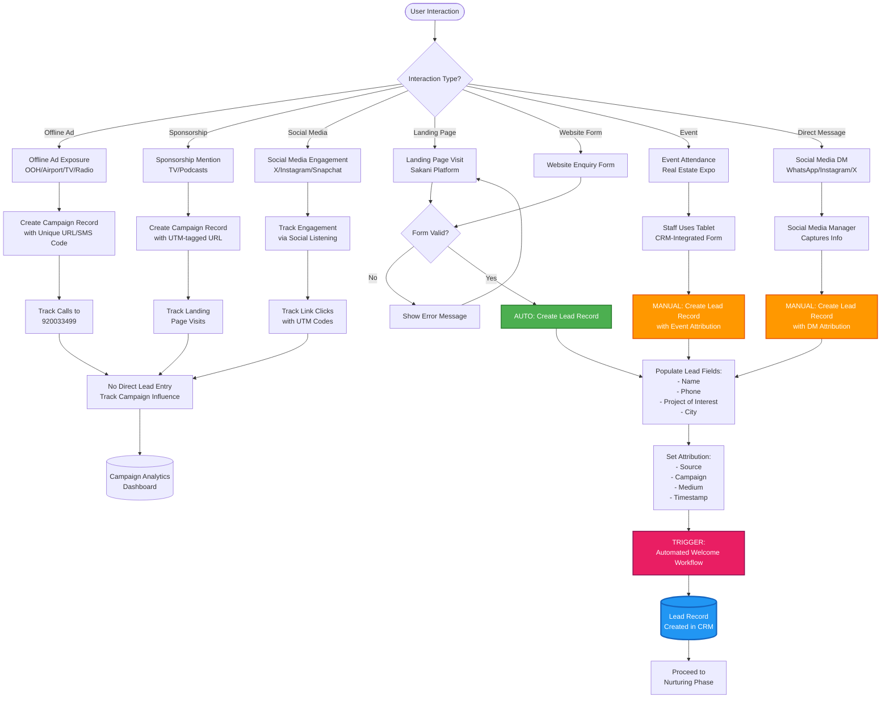
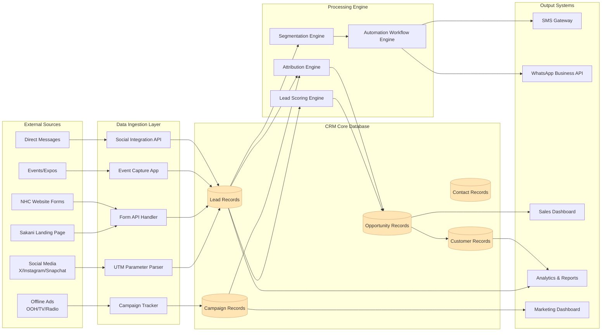
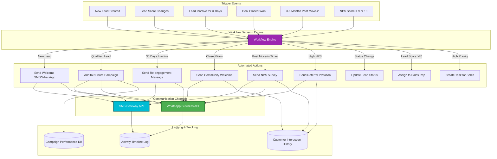
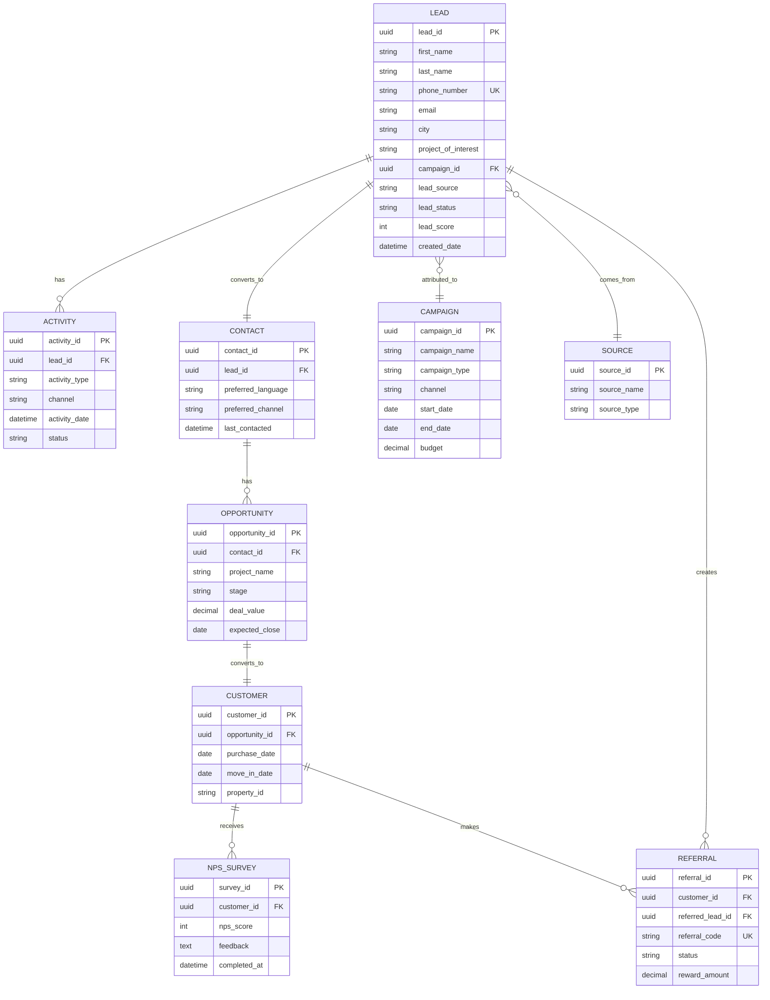
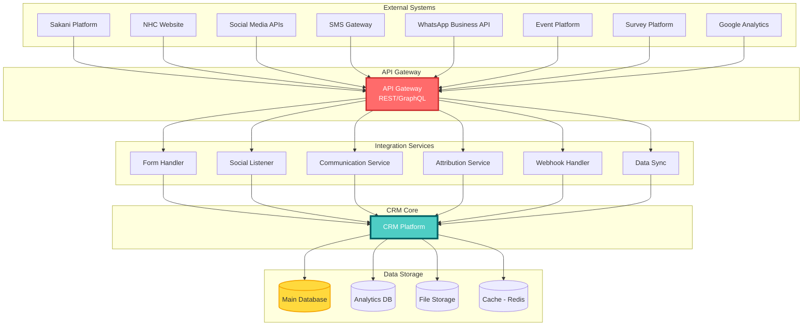

# NHC CRM System - Visual Flowcharts Collection

## About This Document

This document contains the **most important flowcharts** for understanding the NHC CRM system architecture. All diagrams are in **editable Mermaid.js format** - simply copy and paste into https://mermaid.live to view and edit.

---

## 1. MAIN SYSTEM ARCHITECTURE - 4 Phases Overview

This is the master diagram showing all 4 phases of the CRM system and how they connect:



---

## 2. DETAILED LEAD GENERATION FLOW

This shows exactly how leads enter the system from different sources:



---

## 3. LEAD SCORING ALGORITHM

This algorithm determines how hot/warm/cold each lead is:

```mermaid
flowchart TD
    Start([New Lead Created]) --> InitScore[Initialize Score = 0]
    
    InitScore --> CheckProject{Project of<br/>Interest Specified?}
    CheckProject -->|Yes| AddProject[+30 Points]
    CheckProject -->|No| CheckContact
    AddProject --> CheckContact
    
    CheckContact{Complete Contact<br/>Information?}
    CheckContact -->|Email + Phone| AddComplete[+20 Points]
    CheckContact -->|Phone Only| AddPhone[+10 Points]
    CheckContact -->|Email Only| AddEmail[+10 Points]
    AddComplete --> CheckCity
    AddPhone --> CheckCity
    AddEmail --> CheckCity
    
    CheckCity{City Matches<br/>Active Projects?}
    CheckCity -->|Yes| AddCity[+20 Points]
    CheckCity -->|No| CheckBudget
    AddCity --> CheckBudget
    
    CheckBudget{Budget Range<br/>Specified?}
    CheckBudget -->|Yes| AddBudget[+15 Points]
    CheckBudget -->|No| CheckCampaign
    AddBudget --> CheckCampaign
    
    CheckCampaign{Campaign<br/>Performance?}
    CheckCampaign -->|High Performing| AddCampHigh[+15 Points]
    CheckCampaign -->|Standard| AddCampStd[+7 Points]
    CheckCampaign -->|No Campaign| CheckSource
    AddCampHigh --> CheckSource
    AddCampStd --> CheckSource
    
    CheckSource{Lead Source<br/>Quality?}
    CheckSource -->|Event/Referral| AddSourceHigh[+10 Points]
    CheckSource -->|Landing Page| AddSourceMed[+5 Points]
    CheckSource -->|Social DM| AddSourceLow[+2 Points]
    AddSourceHigh --> CheckEngagement
    AddSourceMed --> CheckEngagement
    AddSourceLow --> CheckEngagement
    
    CheckEngagement{Prior<br/>Engagement?}
    CheckEngagement -->|High| AddEngHigh[+10 Points]
    CheckEngagement -->|Medium| AddEngMed[+5 Points]
    CheckEngagement -->|None| CalculateTotal
    AddEngHigh --> CalculateTotal
    AddEngMed --> CalculateTotal
    
    CalculateTotal[Calculate Total Score<br/>Max: 100]
    
    CalculateTotal --> Categorize{Score<br/>Category?}
    
    Categorize -->|80-100| Hot[HOT Lead<br/>Priority: Urgent<br/>SLA: 5 minutes]
    Categorize -->|60-79| Warm[WARM Lead<br/>Priority: High<br/>SLA: 30 minutes]
    Categorize -->|40-59| Cold[COLD Lead<br/>Priority: Standard<br/>SLA: 4 hours]
    Categorize -->|0-39| VCold[VERY COLD Lead<br/>Priority: Low<br/>SLA: 24 hours]
    
    Hot --> AssignRule1[Auto-assign to<br/>Top Sales Rep]
    Warm --> AssignRule2[Auto-assign to<br/>Available Rep]
    Cold --> AssignRule3[Add to<br/>Nurture Queue]
    VCold --> AssignRule4[Auto-nurture<br/>No immediate assignment]
    
    AssignRule1 --> Notify1[Send Instant<br/>Notification]
    AssignRule2 --> Notify2[Send Standard<br/>Notification]
    AssignRule3 --> Notify3[Daily Digest]
    AssignRule4 --> Notify4[No Notification]
    
    Notify1 --> End([Lead Scored<br/>& Routed])
    Notify2 --> End
    Notify3 --> End
    Notify4 --> End
    
    style Hot fill:#FF4444,stroke:#CC0000,stroke-width:3px,color:#fff
    style Warm fill:#FF9933,stroke:#CC6600,stroke-width:2px,color:#fff
    style Cold fill:#FFCC00,stroke:#CC9900,stroke-width:2px
    style VCold fill:#99CCFF,stroke:#6699CC,stroke-width:2px
```



---

## 4. DATA FLOW ARCHITECTURE

This shows how data moves through the entire system:



---

## 5. SALES PIPELINE STAGES

The journey of a lead through the sales process:

```mermaid
flowchart LR
    New[New Lead<br/>Status: New] --> Contacted[First Contact Made<br/>Status: Contacted]
    Contacted --> Qualified[Lead Qualified<br/>Status: Qualified]
    Qualified --> OpptyCreated[Opportunity Created<br/>Status: Opportunity]
    OpptyCreated --> NeedsAnalysis[Needs Analysis<br/>Stage: Discovery]
    NeedsAnalysis --> Proposal[Proposal/Quote<br/>Stage: Proposal]
    Proposal --> Negotiation[Negotiation<br/>Stage: Negotiation]
    Negotiation --> Decision{Decision Point}
    
    Decision -->|Won| ClosedWon[Deal Closed-Won<br/>Status: Customer]
    Decision -->|Lost| ClosedLost[Deal Closed-Lost<br/>Status: Dead]
    Decision -->|Delayed| Nurture[Back to Nurture<br/>Status: Long-term]
    
    Qualified -->|Not Qualified| Disqualified[Disqualified<br/>Status: Dead]
    
    ClosedWon --> CustomerJourney[Customer Journey<br/>Phase 4]
    ClosedLost --> Analytics1[Loss Analysis]
    Disqualified --> Analytics2[Disqualification Tracking]
    Nurture --> AutomatedNurture[Automated Nurture<br/>Campaign]
    
    AutomatedNurture -.->|Re-engaged| Qualified
    
    style New fill:#E3F2FD,stroke:#1976D2,stroke-width:2px
    style Contacted fill:#FFF9C4,stroke:#F57F17,stroke-width:2px
    style Qualified fill:#C8E6C9,stroke:#388E3C,stroke-width:2px
    style OpptyCreated fill:#BBDEFB,stroke:#1565C0,stroke-width:2px
    style NeedsAnalysis fill:#B2DFDB,stroke:#00695C,stroke-width:2px
    style Proposal fill:#D1C4E9,stroke:#5E35B1,stroke-width:2px
    style Negotiation fill:#FFCCBC,stroke:#E64A19,stroke-width:2px
    style ClosedWon fill:#81C784,stroke:#2E7D32,stroke-width:3px,color:#fff
    style ClosedLost fill:#E57373,stroke:#C62828,stroke-width:2px,color:#fff
    style CustomerJourney fill:#4DB6AC,stroke:#00695C,stroke-width:3px,color:#fff
```



---

## 6. AUTOMATION WORKFLOW ENGINE

How automated messages and actions are triggered:



---

## 7. DATABASE ENTITY RELATIONSHIP DIAGRAM (SIMPLIFIED)

The core database structure:



---

## 8. INTEGRATION ARCHITECTURE

How the CRM connects to external systems:



---

## HOW TO USE THESE FLOWCHARTS

### Method 1: Mermaid Live Editor (Easiest)
1. Visit **https://mermaid.live**
2. Copy any diagram code above (between ```mermaid and ```)
3. Paste into the editor
4. Diagram renders instantly
5. Edit the text to modify the diagram
6. Export as PNG, SVG, or PDF

### Method 2: VS Code
1. Install extension: "Markdown Preview Mermaid Support"
2. Open this file in VS Code
3. Press `Ctrl+Shift+V` to preview
4. Diagrams render automatically

### Method 3: GitHub
- Commit this file to your repository
- Mermaid diagrams render automatically

### Method 4: Copy to Documentation
- Paste into Notion, Confluence, or Docusaurus
- Most modern tools support Mermaid natively

---

## EDITING TIPS

### Change Node Text
```
OldNode[Old Text] --> NewNode[New Text]
```

### Add New Connection
```
ExistingNode --> NewNode[New Node Name]
```

### Change Colors
```
style NodeName fill:#FF0000,stroke:#000,color:#fff
```

### Add Decision Point
```
A --> B{Question?}
B -->|Answer 1| C
B -->|Answer 2| D
```

---

## KEY TAKEAWAYS FOR IT TEAM

1. **4 Phases**: Awareness → Lead Gen → Nurturing → Advocacy
2. **Primary Entry Point**: Sakani Landing Page (automatic lead creation)
3. **Lead Scoring**: 0-100 score determines priority and SLA
4. **No Email**: Focus on SMS/WhatsApp for communication
5. **Attribution Critical**: Every lead must know its source
6. **Speed Matters**: Hot leads get 5-minute response SLA

---

**For complete technical specs and implementation details, see:**
- `nhc_crm_technical_specs.md` - Database schemas, APIs, code examples
- `nhc_crm_implementation_guide.md` - Timeline, testing, deployment
- `README.md` - Project overview and navigation

---

© 2025 National Housing Company (NHC) - Technical Documentation
